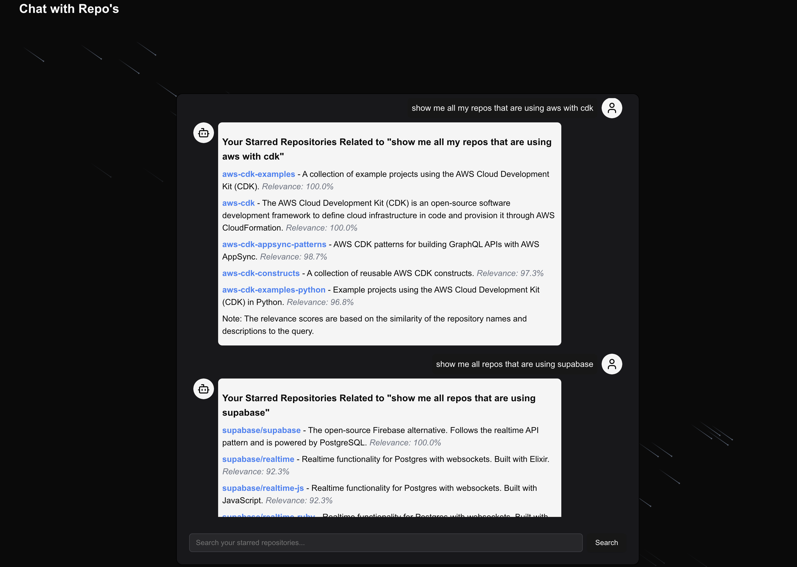
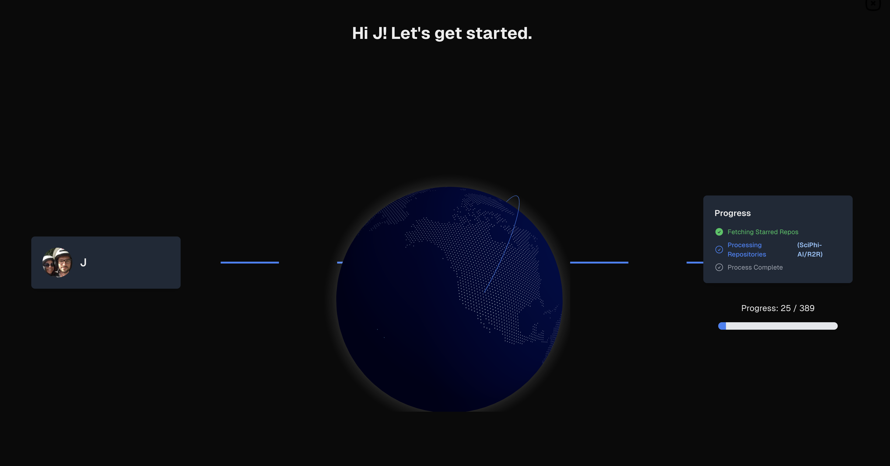
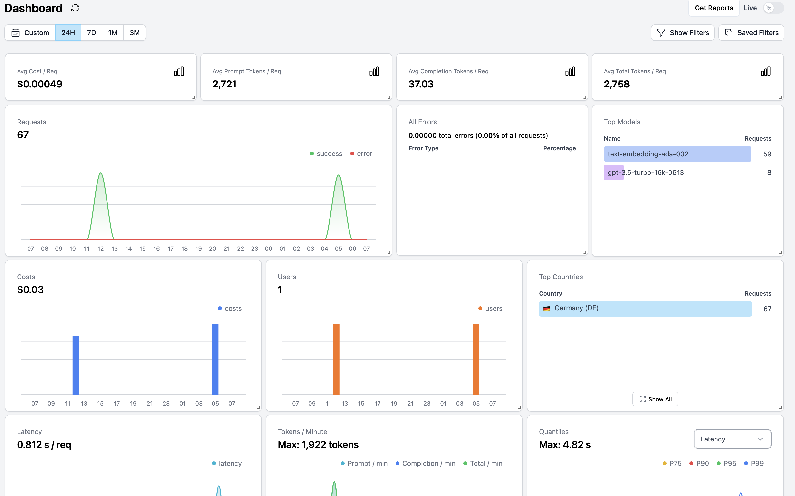

# GitHub RAG Tutorial

## Project Overview

This project allows you to chat with your starred GitHub repositories to easily find the repos you need. It utilizes RAG (Retrieval-Augmented Generation) technology in the background. The process flow is as follows:

1. OAuth GitHub login
2. Fetch all your starred repos
3. Retrieve each repo's README
4. Create chunks from the README content
5. Generate embeddings for each chunk
6. Store the embeddings in a Supabase PostgreSQL vector store with pgvector enabled



## Table of Contents

- [Project Overview](#project-overview)
- [Prerequisites](#prerequisites)
- [Backend Setup](#backend-setup)
- [Helicone Integration](#helicone-integration)
- [Web Frontend Setup](#web-frontend-setup)
- [Database Setup](#database-setup)
- [GitHub OAuth Configuration](#github-oauth-configuration)
- [Running the Application](#running-the-application)

## Prerequisites

- Python 3.8+
- Node.js 14+
- Supabase account (for PostgreSQL with pgvector)
- Poetry (for Python dependency management)
- npm or pnpm (for Node.js dependency management)

## Backend Setup

1. Navigate to the backend directory:

   ```
   cd backend
   ```

2. Install Poetry if you haven't already:

   ```
   curl -sSL https://install.python-poetry.org | python3 -
   ```

3. Add Poetry to your PATH:

   ```
   echo 'export PATH="$HOME/.local/bin:$PATH"' >> ~/.zshrc
   ```

   Or if using bash:

   ```
   echo 'export PATH="$HOME/.local/bin:$PATH"' >> ~/.bash_profile
   ```

4. Restart your terminal or run:

   ```
   source ~/.zshrc  # or ~/.bash_profile
   ```

5. Install dependencies:

   ```
   poetry install
   ```

6. Copy the `.env.example` file to `.env` and configure the necessary environment variables:

   ```
   cp .env.example .env
   ```

7. Start the backend server:
   ```
   poetry run uvicorn server:app --host 0.0.0.0 --port 8000 --reload
   ```



## Helicone Integration

The backend of this project uses Helicone for monitoring the Language Model (LLM). Helicone provides insights and analytics for your LLM usage, helping you optimize performance and costs.

To set up Helicone:

1. Sign up for a Helicone account if you haven't already.
2. Obtain your Helicone API key.
3. Add the Helicone API key to your `backend/.env` file:
   ```
   HELICONE_API_KEY=your_helicone_api_key
   ```
4. Ensure that your LLM requests in the backend code are properly configured to use Helicone.

For more detailed information on setting up and using Helicone, please refer to the [Helicone Quick Start Guide](https://docs.helicone.ai/getting-started/quick-start).



## Web Frontend Setup

1. Navigate to the web directory:

   ```
   cd web
   ```

2. Install dependencies:

   ```
   npm install
   ```

   or if using pnpm:

   ```
   pnpm install
   ```

3. Copy the `.env.example` file to `.env` and configure the necessary environment variables:

   ```
   cp .env.example .env
   ```

4. Start the development server:
   ```
   npm run dev
   ```
   or with pnpm:
   ```
   pnpm dev
   ```

## Database Setup

This project uses [Supabase](https://supabase.com/) PostgreSQL with pgvector enabled for storing and querying vector embeddings. To set up your database:

1. Create a Supabase account if you haven't already.
2. Create a new project in Supabase.
3. In your project's SQL editor, enable the pgvector extension:

   ```sql
   CREATE EXTENSION IF NOT EXISTS vector;
   ```

4. Create the necessary tables and functions:

   ```sql
   -- Create a table for storing repository information
   CREATE TABLE repositories (
     id SERIAL PRIMARY KEY,
     github_username TEXT NOT NULL,
     name TEXT NOT NULL,
     full_name TEXT NOT NULL,
     description TEXT,
     url TEXT NOT NULL,
     language TEXT,
     stars INTEGER,
     created_at TIMESTAMP WITH TIME ZONE DEFAULT CURRENT_TIMESTAMP
   );

   -- Create a table for storing README chunks
   CREATE TABLE readme_chunks (
     id SERIAL PRIMARY KEY,
     repository_id INTEGER REFERENCES repositories(id) ON DELETE CASCADE,
     chunk_index INTEGER NOT NULL,
     content TEXT NOT NULL,
     created_at TIMESTAMP WITH TIME ZONE DEFAULT CURRENT_TIMESTAMP
   );

   -- Create a table for storing embeddings
   CREATE TABLE embeddings (
     id SERIAL PRIMARY KEY,
     repository_id INTEGER REFERENCES repositories(id) ON DELETE CASCADE,
     chunk_id INTEGER REFERENCES readme_chunks(id) ON DELETE CASCADE,
     embedding vector(1536),
     created_at TIMESTAMP WITH TIME ZONE DEFAULT CURRENT_TIMESTAMP
   );

   -- Create indexes for better query performance
   CREATE INDEX idx_repositories_github_username ON repositories(github_username);
   CREATE INDEX idx_readme_chunks_repository_id ON readme_chunks(repository_id);
   CREATE INDEX idx_embeddings_repository_id ON embeddings(repository_id);
   CREATE INDEX idx_embeddings_chunk_id ON embeddings(chunk_id);

   -- Create a function to search for similar embeddings
   CREATE OR REPLACE FUNCTION search_similar_embeddings(query_embedding vector(1536), match_threshold FLOAT, match_count INT)
   RETURNS TABLE (
     repository_id INTEGER,
     chunk_id INTEGER,
     similarity FLOAT
   )
   LANGUAGE plpgsql
   AS $$
   BEGIN
     RETURN QUERY
     SELECT
       e.repository_id,
       e.chunk_id,
       1 - (e.embedding <=> query_embedding) AS similarity
     FROM
       embeddings e
     WHERE
       1 - (e.embedding <=> query_embedding) > match_threshold
     ORDER BY
       similarity DESC
     LIMIT
       match_count;
   END;
   $$;
   ```

5. In your project settings, find your database connection details and add them to your `backend/.env` file:

   ```
   DATABASE_URL=your_supabase_postgres_connection_string
   ```

For more information on using Supabase with pgvector, refer to the [Supabase Vector documentation](https://supabase.com/docs/guides/database/extensions/pgvector).

## GitHub OAuth Configuration

1. Register a new OAuth application on GitHub:

   - Go to your GitHub account settings
   - Navigate to "Developer settings" > "OAuth Apps" > "New OAuth App"
   - Set the "Authorization callback URL" to `http://localhost:3000/api/auth/callback/github`

2. Once registered, you'll receive a Client ID and Client Secret.

3. Add these credentials to your `web/.env` file:
   ```
   GITHUB_CLIENT_ID=your_client_id
   GITHUB_CLIENT_SECRET=your_client_secret
   ```

## Running the Application

1. Start the backend server (from the backend directory):

   ```
   poetry run uvicorn server:app --host 0.0.0.0 --port 8000 --reload
   ```

2. Start the web frontend (from the web directory):

   ```
   npm run dev
   ```

   or with pnpm:

   ```
   pnpm dev
   ```

3. Access the application in your web browser at `http://localhost:3000`
