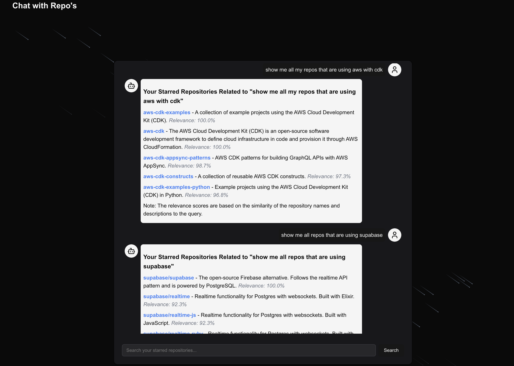
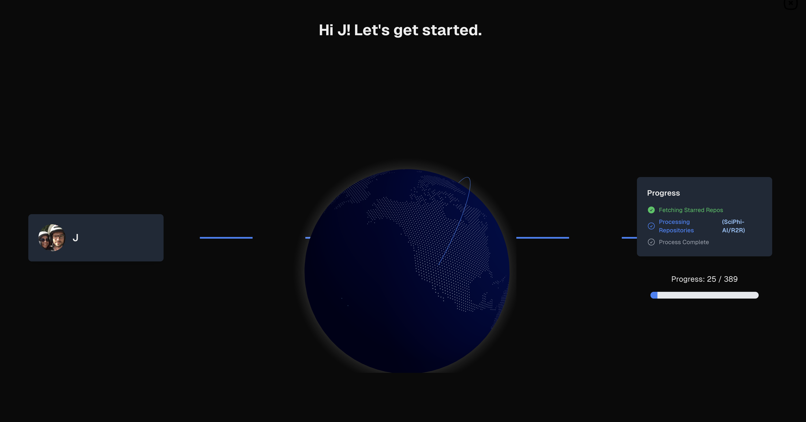

# StarSense Tutorial

## Project Overview

This project allows you to chat with your starred GitHub repositories to easily find the repos you need. It utilizes RAG (Retrieval-Augmented Generation) technology in the background. The process flow is as follows:

1. OAuth GitHub login
2. Fetch all your starred repos
3. Retrieve each repo's README
4. Insert repo information into a PostgreSQL database
5. pgai vectorizer takes care of generating embeddings for each repo
6. Use the embeddings view to query for similar repos



## Table of Contents

- [Project Overview](#project-overview)
- [Prerequisites](#prerequisites)
- [Backend Setup](#backend-setup)
- [Web Frontend Setup](#web-frontend-setup)
- [Database Setup](#database-setup)
- [GitHub OAuth Configuration](#github-oauth-configuration)
- [Running the Application](#running-the-application)

## Prerequisites

- Python 3.8+
- Node.js 14+
- Timescale Account
- Ollama installed and running
- Poetry (for Python dependency management)
- npm or pnpm (for Node.js dependency management)

## Backend Setup

1. Navigate to the backend directory:

   ```
   cd backend
   ```

2. Install Poetry if you haven't already:

   ```
   curl -sSL https://install.python-poetry.org | python3 -
   ```

3. Add Poetry to your PATH:

   ```
   echo 'export PATH="$HOME/.local/bin:$PATH"' >> ~/.zshrc
   ```

   Or if using bash:

   ```
   echo 'export PATH="$HOME/.local/bin:$PATH"' >> ~/.bash_profile
   ```

4. Restart your terminal or run:

   ```
   source ~/.zshrc  # or ~/.bash_profile
   ```

5. Install dependencies:

   ```
   poetry install
   ```

6. Copy the `.env.example` file to `.env` and configure the necessary environment variables:

   ```
   cp .env.example .env
   ```

7. Start the backend server:
   ```
   poetry run uvicorn server:app --host 0.0.0.0 --port 8000 --reload
   ```




## Web Frontend Setup

1. Navigate to the web directory:

   ```
   cd web
   ```

2. Install dependencies:

   ```
   npm install
   ```

   or if using pnpm:

   ```
   pnpm install
   ```

3. Copy the `.env.example` file to `.env` and configure the necessary environment variables:

   ```
   cp .env.example .env
   ```

4. Start the development server:
   ```
   npm run dev
   ```
   or with pnpm:
   ```
   pnpm dev
   ```

## Database Setup


1. Create a timescale account if you haven't already.
2. Create a new database.
3. In Timescale Console > Project Settings, click AI Model API Keys.
Click Add AI Model API Keys, add your key, then click Add API key.
In AI Extenstions make sure to install the following extensions:
- ai
- vector
- vectorscale

4. Create the necessary table to store repository information:

   ```sql
   -- Create a table for storing repository information
   CREATE TABLE repositories (
     id SERIAL PRIMARY KEY,
     github_username TEXT NOT NULL,
     name TEXT NOT NULL,
     full_name TEXT NOT NULL,
     description TEXT,
     readme TEXT,
     url TEXT NOT NULL,
     language TEXT,
     stars INTEGER,
     created_at TIMESTAMP WITH TIME ZONE DEFAULT CURRENT_TIMESTAMP
   );

5. create the vectorizer, 

select ai.create_vectorizer(
    'public.repositories'::regclass
  , embedding=>ai.embedding_openai('text-embedding-3-small', 1536, api_key_name=>'OPENAI_API_KEY')
  , chunking=>ai.chunking_recursive_character_text_splitter('readme')
  , formatting=>ai.formatting_python_template('name: $name url: $url content: $chunk')
); 


  

5. In your project settings, find your database connection details and add them to your `backend/.env` file:

   ```
   DATABASE_URL=your_supabase_postgres_connection_string
   ```

For more information on using Supabase with pgvector, refer to the [Supabase Vector documentation](https://supabase.com/docs/guides/database/extensions/pgvector).


## Setup ollama
We will use ollama for generating the response.
Learn how to setup ollama from [here](https://github.com/ollama/ollama)
Make sure you have llama3 model downloaded and the server is running.

## GitHub OAuth Configuration

1. Register a new OAuth application on GitHub:

   - Go to your GitHub account settings
   - Navigate to "Developer settings" > "OAuth Apps" > "New OAuth App"
   - Set the "Authorization callback URL" to `http://localhost:3000/api/auth/callback/github`

2. Once registered, you'll receive a Client ID and Client Secret.

3. Add these credentials to your `web/.env` file:
   ```
   GITHUB_CLIENT_ID=your_client_id
   GITHUB_CLIENT_SECRET=your_client_secret
   ```

## Running the Application

1. Start the backend server (from the backend directory):

   ```
   poetry run uvicorn server:app --host 0.0.0.0 --port 8000 --reload
   ```

2. Start the web frontend (from the web directory):

   ```
   npm run dev
   ```

   or with pnpm:

   ```
   pnpm dev
   ```

3. Access the application in your web browser at `http://localhost:3000`
